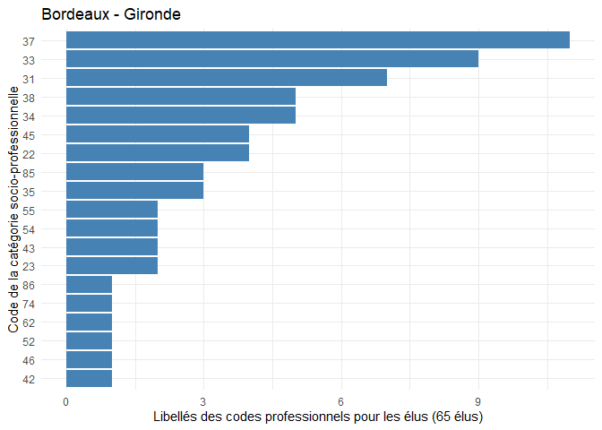
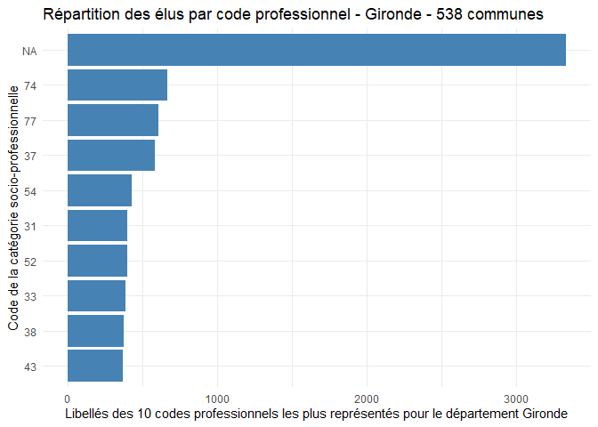

# firstlibjuliette

## Présentation

`firstlibjuliette` est un package R conçu pour fournir des outils
d’analyse des données des élus locaux en France.  
Il permet de : - Valider le format des données, - Calculer des
statistiques sur les élus (âge, fonction, distribution des professions,
etc.), - Visualiser certaines distributions sous forme de graphiques.

Ce package facilite l’analyse des données en proposant des fonctions
dédiées aux communes et aux départements.

## Installation

Pour installer `firstlibjuliette` depuis GitHub, utilisez :

``` r
# Installer devtools si ce n'est pas déjà fait
install.packages("remotes")
#> The following package(s) will be installed:
#> - remotes [2.5.0]
#> These packages will be installed into "C:/Users/julie/AppData/Local/Temp/Rtmpk1j3Lb/temp_libpath4bbc4e057428".
#> 
#> # Installing packages --------------------------------------------------------
#> - Installing remotes ...                        OK [copied from cache in 0.25s]
#> Successfully installed 1 package in 0.28 seconds.

# Installer firstlibjuliette
remotes::install_github("juliette-grison/firstlib_juliette")
#> Using GitHub PAT from the git credential store.
#> Downloading GitHub repo juliette-grison/firstlib_juliette@HEAD
#> Warning in untar2(tarfile, files, list, exdir, restore_times): skipping pax
#> global extended headers

#> Warning in untar2(tarfile, files, list, exdir, restore_times): skipping pax
#> global extended headers
#> ── R CMD build ─────────────────────────────────────────────────────────────────
#>          checking for file 'C:\Users\julie\AppData\Local\Temp\RtmpicGSZ9\remotes453427a46d70\juliette-grison-firstlib_juliette-e723239/DESCRIPTION' ...  ✔  checking for file 'C:\Users\julie\AppData\Local\Temp\RtmpicGSZ9\remotes453427a46d70\juliette-grison-firstlib_juliette-e723239/DESCRIPTION'
#>       ─  preparing 'firstlibjuliette':
#>    checking DESCRIPTION meta-information ...     checking DESCRIPTION meta-information ...   ✔  checking DESCRIPTION meta-information
#>       ─  checking for LF line-endings in source and make files and shell scripts
#>       ─  checking for empty or unneeded directories
#>       ─  building 'firstlibjuliette_0.1.0.tar.gz'
#>      
#> 
#> Installation du package dans 'C:/Users/julie/AppData/Local/Temp/Rtmpk1j3Lb/temp_libpath4bbc4e057428'
#> (car 'lib' n'est pas spécifié)
```

## Utilisation

### Charger le package

``` r
library(firstlibjuliette)
```

### Exemple : Analyser une commune

``` r
# Import de la base de données
df <- firstlibjuliette::df

# Sélection du data.frame
df_bordeaux <- df[df[["Libellé.de.la.commune"]] == "Bordeaux", ]

# Création d'un objet commune
df_bordeaux <- creer_commune(df_bordeaux)

# Résumé des informations de la commune
summary(df_bordeaux)
#> 
#> Nom de la commune : Bordeaux 
#> Nombre d'élu.e.s : 65 
#> Distribution des âges des élu.e.s :
#> # A tibble: 1 × 5
#>   quantile_0 quantile_25 quantile_50 quantile_75 quantile_100
#>        <int>       <dbl>       <dbl>       <dbl>        <int>
#> 1         33          41          50          59           71
#> 
#> L'élu.e le/la plus âgé.e :
#> # A tibble: 1 × 3
#>   Nom.de.l.élu Prénom.de.l.élu   Âge
#>   <chr>        <chr>           <int>
#> 1 JUSTOME      Sylvie             71

# Visualisation des professions des élus
plot(df_bordeaux)
```



### Exemple : Analyser un département

``` r
# Import de la base de données
df <- firstlibjuliette::df

# Sélection du data.frame
df_gironde <- df[df[["Libellé.du.département"]] == "Gironde", ]

# Création d'un objet commune
df_gironde <- creer_departement(df_gironde)

# Résumé des informations de la commune
summary(df_gironde)
#> 
#> Nom du département : Gironde NA 
#> Nombre de communes : 538 
#> Nombre d'élu.e.s : 8599 
#> Distribution des âges des élu.e.s du département :
#> # A tibble: 1 × 5
#>   quantile_0 quantile_25 quantile_50 quantile_75 quantile_100
#>        <int>       <dbl>       <dbl>       <dbl>        <int>
#> 1         23          48          56          67           92
#> 
#> L'élu.e le/la plus âgé.e :
#> # A tibble: 1 × 4
#>   Nom.de.l.élu Prénom.de.l.élu Libellé.de.la.commune   Âge
#>   <chr>        <chr>           <chr>                 <int>
#> 1 LANDRAU      Cécile          Gardegan-Et-Tourtirac    92
#> 
#> L'élu.e le/la plus jeune :
#> # A tibble: 1 × 4
#>   Nom.de.l.élu Prénom.de.l.élu Libellé.de.la.commune   Âge
#>   <chr>        <chr>           <chr>                 <int>
#> 1 MUNOZ        Iana            Etauliers                23
#> 
#> Commune à la moyenne d'âge la plus faible : Balizac 
#> Distribution des âges des élu.e.s dans cette commune :
#> # A tibble: 1 × 5
#>   quantile_0 quantile_25 quantile_50 quantile_75 quantile_100
#>        <int>       <dbl>       <dbl>       <dbl>        <int>
#> 1         31        38.8          41        45.2           64
#> 
#> Commune à la moyenne d'âge la plus élevée : Saint-Martin-De-Lerm 
#> Distribution des âges des élu.e.s dans cette commune :
#> # A tibble: 1 × 5
#>   quantile_0 quantile_25 quantile_50 quantile_75 quantile_100
#>        <int>       <dbl>       <dbl>       <dbl>        <int>
#> 1         47        59.5          71          79           82

# Visualisation des professions des élus
plot(df_gironde)
```



## Aperçu des fonctionnalités principales

### Fonctions de création

creer_commune() : Convertit un data.frame en objet commune.

creer_departement() : Convertit un data.frame en objet departement.

### Fonctions d’analyse

summary.commune() : Affiche des statistiques clés sur une commune.

summary.departement() : Affiche des statistiques clés sur un
département.

### Fonctions de visualisation

plot.commune() : Génère un graphique des professions des élus d’une
commune.

plot.departement() : Génère un graphique des professions des élus d’un
département.

## Compléments et documentation

Pour plus de détails, consultez les vignettes et la documentation
complète sur le site du package :
<https://juliette-grison.github.io/firstlib_juliette/>.

Ce package s’inscrit dans l’analyse des données publiques sur les élus
locaux et peut être utilisé pour la recherche, la transparence et
l’exploration des données électorales en France.
